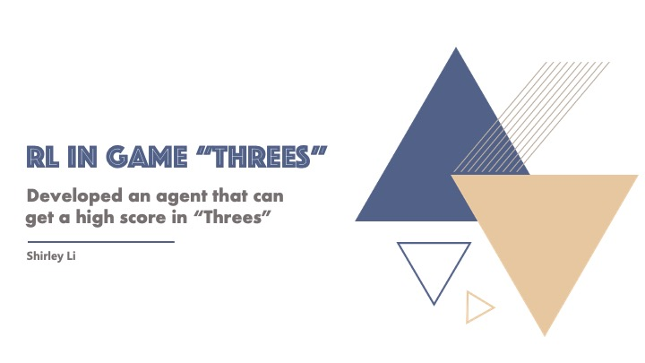

# Reinforcement Learning in "Threes"

## Presentation

### What is "Threes" and how it plays?

"Threes", as the prototype of a well-known game 2048, is a mobile game in a 4 by 4 grid environment. 
Similar to 2048, "Threes" require the player to swipe up/down/left/right to move the tiles. 
There are numbers on the tiles and two tiles will be merged if the numbers on them the same. 
The goal of these games is to reach as high score as you can, 
which is determined by the number value of the tiles on the grid.
But different from 2048, a swipe in "Threes" will not move the tiles to the end of the grid, 
but by one grid. Also, all the numbers are the exponent of 2 in 2048, while the numbers of "Threes" 
start from 1, 2, 3, 6, 12, ... , 

### Problem Statement
 - Can we make a computer agent to learn how to play the game "Threes"?
 - If it can learn the game, can it play the game better than humans?

The goal for this project is to solve the above problem with Reinforcement Learning methods.

### Reinforcement Framework

 - Environment: A 4X4 grid (a 4X4 matrix in the model)
 - Agent: Humans or Computer
 - State: the flatten matrix with number (0 means no tile)
 - Action: Up/Down/Left/Right (WSAD control)
 - Reward: The changed (score + maximum number) after each move
 - Final Score: Sum of 3^Log(2(n(i)/3)+1), (n(i): the number in the grid that is larger than 2.)

### Project Results and Analysis

